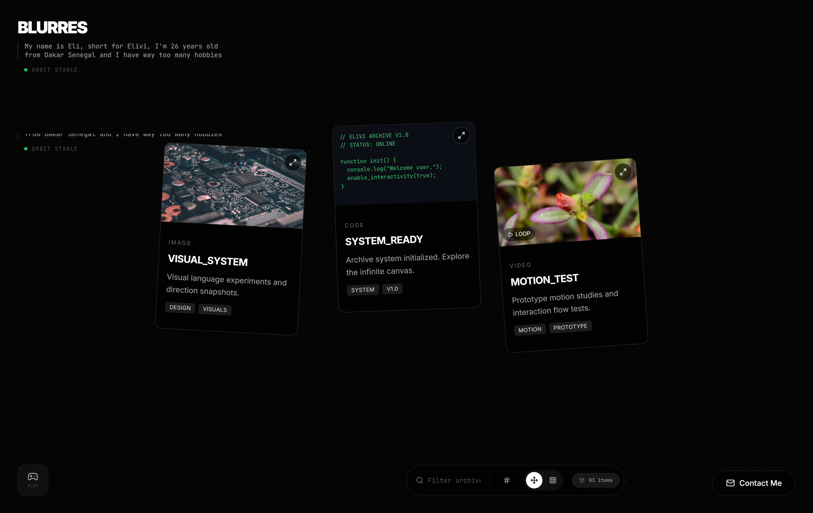
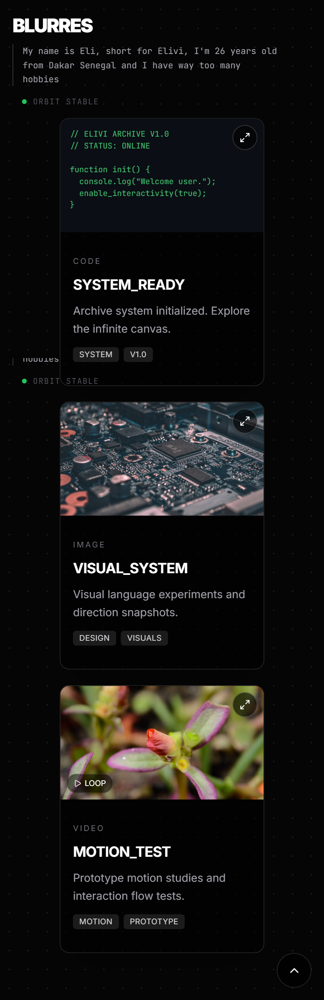

# Elivi Portfolio Frontend

This project is an interactive portfolio website built for creative and technical showcase.
It presents projects as dynamic cards on a canvas-like layout with smooth transitions,
filter controls, and an expanded detail view for each project.

The app is frontend-only and is designed to be fast, visually clean, and easy to deploy.

## What this app does

- Shows portfolio projects as interactive cards
- Supports grid and freeform browsing modes
- Lets visitors filter content by search and tags
- Opens full-screen project details with media preview
- Adapts to mobile with a simplified control experience
- Disables heavier interactions on smaller devices for smoother performance

## Tech stack

- React 19
- TypeScript
- Vite
- Framer Motion
- Lenis
- Lucide React

## Project structure (high level)

- src/App.tsx: main layout and app state
- src/components: UI building blocks (cards, dock, modal, mini-game)
- src/data/portfolio.ts: portfolio content and seed data
- public: static assets such as sitemap, robots, and social preview

## Run locally

1. Install dependencies
	 npm install

2. Start development server
	 npm run dev

3. Open the local URL shown in terminal

## Production build

- Build
	npm run build

- Preview build
	npm run preview

## Deployment (free hosting)

Recommended: Vercel free plan.

1. Push this folder to GitHub
2. Import repo into Vercel
3. Keep default Vite settings
4. Build command: npm run build
5. Output directory: dist

You will get a free URL like:
https://your-project-name.vercel.app

After deployment, update your final public URL in:

- index.html (canonical and social tags)
- public/robots.txt
- public/sitemap.xml

## Notes for collaborators

This repo intentionally keeps project content in one data file so non-developers can
update titles, descriptions, and media links without changing core UI logic.

## Screenshots

Add your screenshots to:

`docs/screenshots/`

Recommended files:

- `home-desktop.png`
- `home-mobile.png`
- `project-expanded.png`

Once added, they will render on GitHub here:

### Desktop

### Mobile

### Project Expanded View

